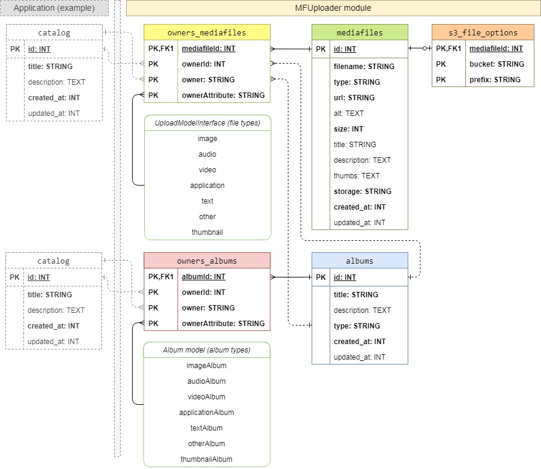

Yii2 Multi format uploader module
==============

1 Introduction
----------------------------

[](https://packagist.org/packages/itstructure/yii2-multi-format-uploader)
[](https://packagist.org/packages/itstructure/yii2-multi-format-uploader)
[](https://packagist.org/packages/itstructure/yii2-multi-format-uploader)
[](https://packagist.org/packages/itstructure/yii2-multi-format-uploader)
[](https://scrutinizer-ci.com/g/itstructure/yii2-multi-format-uploader/build-status/master)
[](https://scrutinizer-ci.com/g/itstructure/yii2-multi-format-uploader/?branch=master)

**MFUploader** -- Module for the Yii2 Framework to upload some type of files to local or S3 Amazon storage.
MFUploader module provides the following options:
- Upload files to local storage.
- Upload files to remote Amazon S3 storage.
- Support file formats: **image**, **audio**, **video**, **application**, **text**.
- Link uploaded files with external application owners (pages, articles, posts e.t.c...).
- Manage internal albums: **imageAlbum**, **audioAlbum**, **videoAlbum**, **applicationAlbum**, **textAlbum**, **otherAlbum**.
- Link uploaded files with internal albums (owners).
- Link internal albums with the external owners (pages, articles, posts e.t.c...).

To work with image binary content it uses [Yii2 imagine](https://github.com/yiisoft/yii2-imagine).
To work with Amazon it uses [AWS SDK](https://github.com/aws/aws-sdk-php).

2 Dependencies
----------------------------

- php >= 7.1
- composer
- MySql >= 5.5

3 Installation
----------------------------

### 3.1 Base install

Via composer:

```composer require "itstructure/yii2-multi-format-uploader": "^2.0.1"```

or in section **require** of composer.json file set the following:
```
"require": {
    "itstructure/yii2-multi-format-uploader": "^2.0.1"
}
```
and command ```composer install```, if you install yii2 project extensions first,

or command ```composer update```, if all yii2 project extensions are already installed.

### 3.2 If you are testing this package from local server directory

In application ```composer.json``` file set the repository, like in example:

```
"repositories": [
    {
        "type": "path",
        "url": "../yii2-multi-format-uploader",
        "options": {
            "symlink": true
        }
    }
],
```

Here,

**yii2-multi-format-uploader** - directory name, which has the same directory level like application and contains yii2 multi format uploader package.

Then run command:

```composer require itstructure/yii2-multi-format-uploader:dev-master --prefer-source```

### 3.3 Apply module migrations

For that make next, **if not already done**:
    
- Define **mfuploader** module in application **console** config file:

    ```php
    use Itstructure\MFUploader\Module as MFUModule;
    ```
    ```php
    'modules' => [
        'mfuploader' => [
            'class' => MFUModule::class,
        ],
    ],
    ```

- In file **yii**, that is located in application root directory, set **@mfuploader** alias:

    ```php
    $application = new yii\console\Application($config);
    
    \Yii::setAlias('@mfuploader', $application->getModule('mfuploader')->getBasePath());
    
    $exitCode = $application->run();
    ```
    
    OR
    
    ```php
    use Itstructure\MFUploader\Module as MFUModule;
    ```
    
    ```php
    $application = new yii\console\Application($config);
    
    \Yii::setAlias('@mfuploader', MFUModule::getBaseDir());
    
    $exitCode = $application->run();
    ```
    
- Run command in console:

    ```
    yii migrate --migrationPath=@mfuploader/migrations
    ```
    
    The data base structure:
    
    

4 Usage
----------------------------

### 4.1 Main properties

The **name** of module: ```mfuploader```

The **namespace** for used classes: ```Itstructure\MFUploader```.

The **alias** to access in to module root directory: ```@mfuploader```.

### 4.2 Application config

Base application config must be like in example below:

```php
use Itstructure\MFUploader\Module as MFUModule;
use Itstructure\MFUploader\controllers\ManagerController;
use Itstructure\MFUploader\controllers\upload\{
    LocalUploadController,
    S3UploadController
};
use Itstructure\MFUploader\controllers\album\{
    ImageAlbumController,
    AudioAlbumController,
    VideoAlbumController,
    ApplicationAlbumController,
    TextAlbumController,
    OtherAlbumController
};
use Itstructure\MFUploader\components\{
    LocalUploadComponent,
    S3UploadComponent
};
```

```php
'modules' => [
    'mfuploader' => [
        'class' => MFUModule::class, // REQUIRED
        'layout' => ...path to layout..., // NOT REQUIRED
        'view' => ...view component config..., // NOT REQUIRED
        'controllerMap' => [ // CUSTOM
            'upload/local-upload' => LocalUploadController::class,
            'upload/s3-upload' => S3UploadController::class,
            'managers' => ManagerController::class,
            'image-album' => ImageAlbumController::class,
            'audio-album' => AudioAlbumController::class,
            'video-album' => VideoAlbumController::class,
            'application-album' => ApplicationAlbumController::class,
            'text-album' => TextAlbumController::class,
            'other-album' => OtherAlbumController::class,
        ],
        'accessRoles' => ['admin', 'manager', e.t.c...], // CUSTOM
        'defaultStorageType' => MFUModule::STORAGE_TYPE_S3, // CUSTOM
        'components' => [ // CUSTOM
            'local-upload-component' => [ // CUSTOM
                'class' => LocalUploadComponent::class,
                'checkExtensionByMimeType' => false
            ],
            's3-upload-component' => [ // CUSTOM
                'class' => S3UploadComponent::class,
                'checkExtensionByMimeType' => false,
                'credentials' => require __DIR__ . '/aws-credentials.php',
                'region' => 'us-west-2',
                's3DefaultBucket' => 'bucketname',
            ],
        ],
    ],
],
```

**Note:** It is not necessary to configure two components: ```local-upload-component``` and ```s3-upload-component```.
You must configure minimum one component, according with the ```defaultStorageType```.

### 4.3 File field for the view template

**File field** must be rendered by ```FileSetter``` widget.

It is necessary to send an ID or URL of uploaded mediafile to you application controller and set in 
model.
An after that to link mediafile ID with owner.

Example (for image files):

```php
use Itstructure\MFUploader\widgets\FileSetter;
use Itstructure\MFUploader\Module as MFUModule;
use Itstructure\MFUploader\interfaces\UploadModelInterface;
```
```html
Container to display selected image.
<div class="media">
    <div id="mediafile-container">
    </div>
    <div class="media-body">
        <h4 id="title-container" class="media-heading"></h4>
        <div id="description-container"></div>
    </div>
</div>
```
```php
echo FileSetter::widget([
    'model' => $model,
    'attribute' => UploadModelInterface::FILE_TYPE_IMAGE,
    'neededFileType' => UploadModelInterface::FILE_TYPE_IMAGE,
    'buttonName' => MFUModule::t('main', 'Set image'),
    'options' => [
        'id' => Html::getInputId($model, UploadModelInterface::FILE_TYPE_IMAGE)
    ],
    'mediafileContainer' => '#mediafile-container',
    'titleContainer' => '#title-container',
    'descriptionContainer' => '#description-container',
    'owner' => 'post', // can be page, article, catalog e.t.c...
    'ownerId' => {current owner id, post id, page id e.t.c.},
    'ownerAttribute' => UploadModelInterface::FILE_TYPE_IMAGE,
    'subDir' => 'post' // can be page, article, catalog e.t.c...
]);
```

### 4.4 Configure upload components

#### 4.4.1 Base attributes in BaseUploadComponent

**Note:** BaseUploadComponent - the base class, which LocalUploadComponent and S3UploadComponent extend.

To understand the principles of configure the base attributes, see public attributes in ```components\BaseUploadComponent``` class.
But it may be difficult to configure ```thumbsConfig``` and ```thumbFilenameTemplate```.
Attribute ```thumbsConfig``` takes the values according with the next chain:
1. From the default config file ```config/thumbs-config.php``` in module **init()** function.
2. Can be rewrited by custom during module ```thumbsConfig``` attribute.
3. Previous config result inserted in to the ```LocalUploadComponent``` and ```S3UploadComponent``` module components.
4. Configuration ```thumbsConfig``` in module components can be rewrited by custom during component ```thumbsConfig``` attribute.

#### 4.4.2 Attributes in LocalUploadComponent

That is very simple. See public attributes in ```components\LocalUploadComponent``` class.

#### 4.4.3 Attributes in S3UploadComponent

See public attributes in ```components\S3UploadComponent``` class.
But there are important attributes:
- ```credentials```. Attribute to access in to Amazon web services account.
    Can be: array, callable, and other. See https://docs.aws.amazon.com/aws-sdk-php/v3/guide/guide/credentials.html.
- ```s3DefaultBucket``` - bucket, which you use to upload files as default.
- ```s3Buckets``` - buckets to upload files depending on the owner. Not required.

    config example:
    ```php
    's3Buckets' => [
      'post' => 'bucketWithPosts',
      'page' => 'bucketWithPages',
      'imageAlbum' => 'bucketWithImages',
      'audioAlbum' => 'bucketWithAudio',
    ]
    ```
    
For more information of S3 configuration, see the next links:
- https://docs.aws.amazon.com/aws-sdk-php/v3/guide/index.html
- https://docs.aws.amazon.com/aws-sdk-php/v3/api
- https://github.com/aws/aws-sdk-php

### 4.5 Link entities with owners

To link entities (mediafiles and albums) with owners (pages, articles, posts e.t.c...) there is the abstract class ```behaviors\Behavior```.

You must use child classes: ```behaviors\BehaviorMediafile``` and ```behaviors\BehaviorAlbum```.

Explanation by example.

You have a ```catalog``` model which extends an ActiveRecord yii2 class.

Use a ```behaviors\BehaviorMediafile``` and ```behaviors\BehaviorAlbum``` in **behaviors** of your ```catalog``` model to link mediafiles and albums with catalog after: **insert active record**, **update active record**, **delete active record**:

```php
use Itstructure\MFUploader\behaviors\{BehaviorMediafile, BehaviorAlbum};
use Itstructure\MFUploader\interfaces\UploadModelInterface;
use Itstructure\MFUploader\models\album\Album;
```
```php
public $thumbnail;

public $imageAlbum = [];

public function behaviors()
{
    return ArrayHelper::merge(parent::behaviors(), [
        'mediafile' => [
            'class' => BehaviorMediafile::class,
            'name' => static::tableName(),
            'attributes' => [
                UploadModelInterface::FILE_TYPE_THUMB,
            ],
        ],
        'albums' => [
            'class' => BehaviorAlbum::class,
            'name' => static::tableName(),
            'attributes' => [
                Album::ALBUM_TYPE_IMAGE,
            ],
        ],
    ]);
}
```

**Note:** This block should be used in conjunction with the ```FileSetter``` widget inside the view form template!

Here the following happens:

- If you use a "thumbnail" name of ```attribute``` param in FileSetter widget, the uploaded mediafile (thumbnail) will be linked with ```catalog``` after insert new catalog data to the data base.
- If you use an "imageAlbum" (by Album::ALBUM_TYPE_IMAGE) name of the ```name``` attribute of dropdown or checkbox html field, the last created image album will be linked with ```catalog``` after insert new catalog data to the data base.

That works according with the next data base example structure:

```Table "mediafiles"``` - record with id=20 now inserted.

```php
| id  | ... |      created_at     |      updated_at     |
|-----|-----|---------------------|---------------------|
| ... | ... |         ...         |         ...         |
| 20  | ... | 2018-05-06 21:35:04 | 2018-05-06 21:35:10 |
```

```Table "catalog"``` - record with id=10 inserted after create mediafile (id=20).

```php
| id  | ... |      created_at     |      updated_at     |
|-----|-----|---------------------|---------------------|
| ... | ... |         ...         |         ...         |
| 10  | ... | 2018-05-06 21:35:20 | 2018-05-06 21:35:25 |
```

```Table "owners_mediafiles"```

```php
| mediafileId | ownerId |   owner   |  ownerAttribute  |
|-------------|---------|-----------|------------------|
|     ...     |   ...   |    ...    |        ...       |
|     20      |    10   |  catalog  |     thumbnail    |
```

```Table "albums"```

```php
| id  |     type    | ... |      created_at     |      updated_at     |
|-----|-------------|-----|---------------------|---------------------|
| ... |     ...     | ... |         ...         |         ...         |
|  5  | imageAlbum  | ... | 2018-05-06 21:30:00 | 2018-05-06 21:30:05 |
```

```Table "owners_albums"```

```php
| albumId | ownerId |   owner   |  ownerAttribute  |
|---------|---------|-----------|------------------|
|   ...   |   ...   |    ...    |        ...       |
|    5    |    10   |  catalog  |    imageAlbum    |
```

**Note:** If you set in ```FileSetter``` widget the attributes: ```owner```, ```ownerId```, ```ownerAttribute``` - linking entity with owner will be done automatically during ajax request in **uploadmanager**.

### 4.6 Integrated album controllers

There are already integrated album controllers in the namespace: ```Itstructure\MFUploader\controllers\album```.
Controllers provide the work with the next types of albums: **imageAlbum**, **audioAlbum**, **videoAlbum**, **applicationAlbum**, **textAlbum**, **otherAlbum**.

For that controllers there are already the models and view templates.

To work with that, you must set just the routes in application configuration.

License
----------------------------

Copyright © 2018 Andrey Girnik girnikandrey@gmail.com.

Licensed under the [MIT license](http://opensource.org/licenses/MIT). See LICENSE.txt for details.
